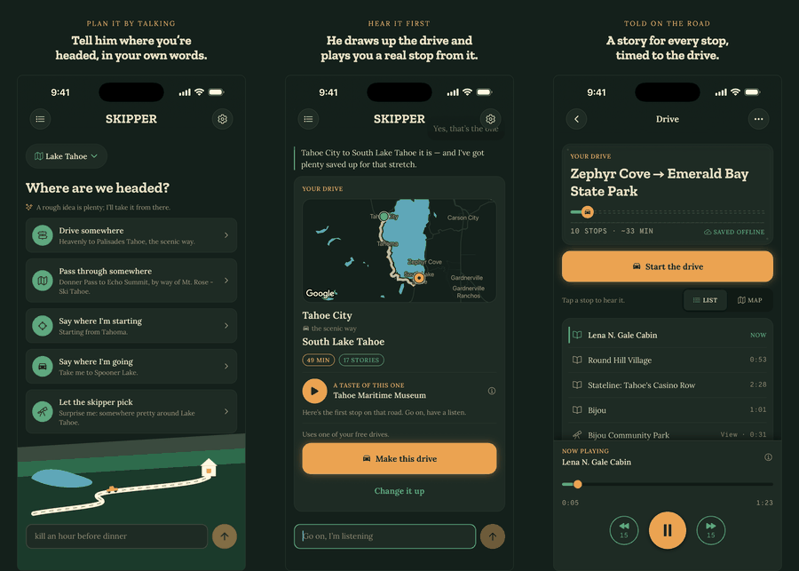

# Skipper

**A corny old tour guide rides shotgun and narrates your drive.**

[](https://apps.apple.com/us/app/skipper-road-trip-audio-tours/id6778946770)
[](https://skipper.fm)
[](apps/ios)
[](apps/api)
[](packages/studio)
[](packages/studio)
[](LICENSE)

<p align="center">
  <a href="https://apps.apple.com/us/app/skipper-road-trip-audio-tours/id6778946770"></a>
</p>



_The 1.1 App Store listing screenshots, captured from the shipped app — three at a time, all
six in [`assets/store/`](assets/store). First region: Lake Tahoe._

An AI-narrated, GPS-triggered driving audio tour. Think _Shaka Guide, but the
narration is AI-generated_ — played by a charming Jungle-Cruise-skipper persona,
over a route you pick (any A→B), as phone audio (CarPlay later). First region:
**Lake Tahoe**.

> **Posture:** a toy / lifestyle side project. Optimize for _charm_ and for being
> a thing the founder actually wants to use — not for scale or defensibility.
> **The persona is the product.**

**Working in this repo?** `CLAUDE.md` is the operating truth — doctrine, hard invariants,
stack, and the (multi-agent) git workflow; read it before changing anything. Durable
decisions, specs, and ideas live in `docs/` (indexed in `docs/README.md`).

## The two principles

1. **Fetch FACTS once per place; the NARRATION is the shared atom; ASSEMBLE per drive.**
   `pois` is the facts cache — a place's grounded facts (TTL + hash), SHARED by every
   drive. Each place has ONE shared telling: a `narrations` row (1:1 per poi). ONE thing
   consumes that corpus: the user-owned **DRIVE**, which REUSES those narrations
   pre-ordered along its route. Content resolves LIVE via subject id, so a regenerated
   telling auto-improves every saved drive. (The anonymous front door is the PLANNER —
   plan/propose a route + one preview clip — not a second content mode.)
2. **The route is the rails; the generation is everything inside.**
   A drive's route is materialized from the rider's A→B (Google Routes) and frozen per
   drive — the LLM resolves ONLY the endpoints, and the SELECTION of which narrations ride
   the route is deterministic. Inside the rails the corpus does the work: which stories,
   the persona, pacing, the voice. _Hand-authored tours are deferred — the rider picks the
   road, the shared corpus narrates it._

## Stack

- **TypeScript 6 + Bun** for backend/tooling workspaces; **Swift + Xcode** for native iOS
- **Backend:** Hono (served natively by bun) · **DB:** Neon + Drizzle · **Auth:** Better Auth (freemium) · **Audio:** Cloudflare R2 (private; presigned URLs) via `@skipper/storage`
- **Routing:** Google Routes (A→B route materialization) via `@skipper/routing`
- **AI:** Claude Opus 4.6 via Amazon Bedrock (narration, judges, the live planner — [decision](docs/decisions/bedrock-opus-4-6.md)) · Google Cloud Text-to-Speech — Gemini-TTS voice "Charon" (OAuth/ADC, no API key; AAC-LC 48 kbps .m4a — LINEAR16 from TTS, then ffmpeg loudnorm + AAC encode)
- **iOS:** SwiftUI/Observation, iOS 17+, native Google Maps, AVFoundation/MediaPlayer and Core Location. The Expo client is retained until native acceptance; future Android is separate. CarPlay remains deferred.

## Layout

```
skipper/
├── apps/
│   ├── api/        @skipper/api       — Hono API: /drives (+ /drives/plan, /drives/propose), /regions, /sample, signed R2 URLs. Bun-native serve.
│   ├── admin/      @skipper/admin     — Vite + Hono ops console (cloud-run the studio CLIs) behind Google IAP.
│   ├── site/       @skipper/site      — Astro landing page (skipper.fm).
│   ├── ios/        Skipper.xcodeproj  — native iPhone app, unit/UI tests and bundled brand assets.
│   └── mobile/     @skipper/mobile    — shipped Expo client retained pending native acceptance.
├── packages/
│   ├── shared/     @skipper/shared    — Zod schemas + types, imported everywhere.
│   ├── db/         @skipper/db        — Drizzle schema + Neon client.
│   ├── studio/     @skipper/studio    — server-side narration/corpus generation (discover → enrich → generate).
│   ├── routing/    @skipper/routing   — Google Routes client (A→B route materialization).
│   ├── storage/    @skipper/storage   — Cloudflare R2 / S3 client (audio upload + presign).
│   ├── engine/     @skipper/engine    — retained TypeScript geo/trigger engine + simulator; native client behavior is ported to Swift.
│   └── sim/        @skipper/sim       — DB-backed drive-sim CLI (runs @skipper/engine against a real drive).
├── design-system/  — browsable HTML mirror of the "Trailhead 89" design system (open index.html). A specimen book; not a workspace. Canonical source = apps/ios/DESIGN.md + Skipper/Design and native components.
├── tsconfig.base.json · package.json (bun workspaces)
```

Internal packages export **TypeScript source** directly (no dist build) — bun
runs `.ts`, and `tsc --noEmit` type-checks. There is no `tsx`, no
`@hono/node-server`: bun covers both.

## Getting started

```bash
bun install
bun run dev:api      # the API on http://localhost:8787 (dotenvx decrypts .env.development, bun --watch)
bun run check        # all repository lints, typechecks, and tests — run before committing
```

Other dev surfaces (the human keeps these running — use them, don't restart a live one):

- `bun run dev:admin` — the ops console (Vite client **:5173** → Hono admin-api **:8788**; cloud-runs the studio CLIs)
- `bun run dev:site` — the Astro landing page
- `bun run ios:configure` — native client config from ignored JSON or `SKIPPER_*` environment
- `bun run ios:check` — native Xcode build and simulator unit/UI tests (no Metro)
- `bun run ios:release` / `bun run asc:builds` — reviewed native release/readiness workflow; actual distribution delivery remains pending
- `bun run sim` — the DB-backed drive simulator (`packages/sim`)

### Coding agents

Claude and Codex share this checkout. `CLAUDE.md` remains the operating truth;
Codex enters through `AGENTS.md`; native contributors also read `apps/ios/CLAUDE.md` and `apps/ios/DESIGN.md`.
No application provider or model changes are needed to develop with either agent.

Project workflows live in `.claude/skills`; `.agents/skills` links to that directory
for [Codex skill discovery](https://learn.chatgpt.com/docs/build-skills).
Use `/ship`, `/investigate`, `/sim-qa`, etc. in Claude or `$ship`, `$investigate`,
`$sim-qa` in Codex. New workflows added to the canonical directory are shared
automatically. Start a fresh Codex session if they are absent from the skill list.

Project-scoped Codex model defaults and helper limits live in `.codex/config.toml`;
the scout and reviewer definitions live in `.codex/agents/`. Follow the shared
[delegation guide](docs/guides/agent-delegation.md) for when to delegate, model
selection, and a read-only smoke test. Project configuration enables helpers for
this checkout without changing personal defaults for other projects.

The tracked `.codex/hooks.json` runs the same STOP-list guard and documentation
lints as Claude, including multi-file Codex patches. Hook commands find the repo
root, so they also work from nested workspaces. Open `/hooks` in the Codex CLI to
review and trust these definitions: Codex skips untrusted project hooks. See the
[official hook documentation](https://learn.chatgpt.com/docs/hooks).

Codex supports hard denials but currently does not support Claude's hook `ask`
decision. The guard's Codex mode therefore blocks the NEVER list and supplies
the other rules as authorization reminders. Those reminders are **not a mechanical
approval gate**: the agent must check for the founder's explicit go before paid
operator runs or other actions requiring approval. Trusting hooks is not that go.
The written rules apply in clients without hook support as well.

Use the existing Bun installation and dependencies; run `bun install` if missing.
Root `bun run check` provides local validation without loading dotenvx secrets or
running paid operator jobs. Its native release fixture tests currently require macOS
`plutil`; the retained Linux Cloud Build jobs do not invoke this root script suite.
See the [conversion CI audit](docs/designs/native-ios-conversion.md#retained-linux-ci-boundary). Native changes also need relevant `bun run ios:check` coverage;
full acceptance requires the full suite plus upgrade/device/distribution evidence. Explicit
changes to the retained Expo client still need its own workspace check. Leave the human's
dev servers running and preserve other agents' uncommitted changes. Environment access is described below; development and
production currently share the same database and storage, so the label is not
a safety boundary.

### Environment & secrets

Secrets are managed with [dotenvx](https://dotenvx.com). `.env.development` and
`.env.production` are committed **encrypted** (public-key); the private decryption
keys live only in `.env.keys`, which is gitignored — **never commit it**.

- **Onboarding:** get `.env.keys` from a teammate (1Password / Signal / AirDrop),
  then `bun run dev:api`. No `.env` copying.
- **Set a value:** `dotenvx set DATABASE_URL "postgres://…" -f .env.development`
  (repeat with `-f .env.production` for prod), then commit the encrypted file.
- `.env.example` is the plaintext catalog of which vars exist.
- **Deploy:** set `DOTENV_PRIVATE_KEY_PRODUCTION` in the host env; dotenvx
  decrypts at start.

### Native client configuration

Use ignored `.scratch/ios/client-config.json` with string keys `SKIPPER_API_URL`,
`SKIPPER_GOOGLE_MAPS_API_KEY`, `SKIPPER_POSTHOG_KEY` and `SKIPPER_POSTHOG_HOST`.
Explicit environment values override the file, including empty values; `SKIPPER_IOS_CONFIG_PATH`
selects another file. `bun run ios:configure --release` requires the canonical production
origin `https://api.skipper.fm` and public SDK keys. Configuration no longer reads the legacy
client's `.env`. Keep local inputs private (mode 0600) and never commit or print their values.
The checked-in Xcode configs contain no SDK keys and include the ignored generated configs.

`SKIPPER_IOS_SIMULATOR_ID` chooses a dedicated simulator; `SKIPPER_IOS_DERIVED_DATA` isolates
builds. Native simulator runs use ad-hoc signing so SystemKeychain gets its application
identifier. Distribution credentials are not needed for simulator tests. A build with signing
disabled establishes compilation/mock behavior, not real credential persistence.

Read the [conversion plan](docs/designs/native-ios-conversion.md),
[native verification](docs/guides/native-ios-verification.md), and
[upgrade rehearsal](docs/guides/native-ios-upgrade-rehearsal.md) for current evidence.
Preserve `apps/mobile` and backend installed-client compatibility until acceptance and the
coordinated cutover. The [release implementation](docs/guides/native-ios-release.md) has passed
independent code review; signed archive, cloud symbols and Apple delivery evidence remain pending.

### Database

```bash
bun run db:push      # apply schema to Neon (dev)
bun run db:studio    # browse
bun run db:migrate   # run migrations (db:migrate:prod targets .env.production)
```

## License

[MIT](LICENSE) © 2026 Peter Shih.
